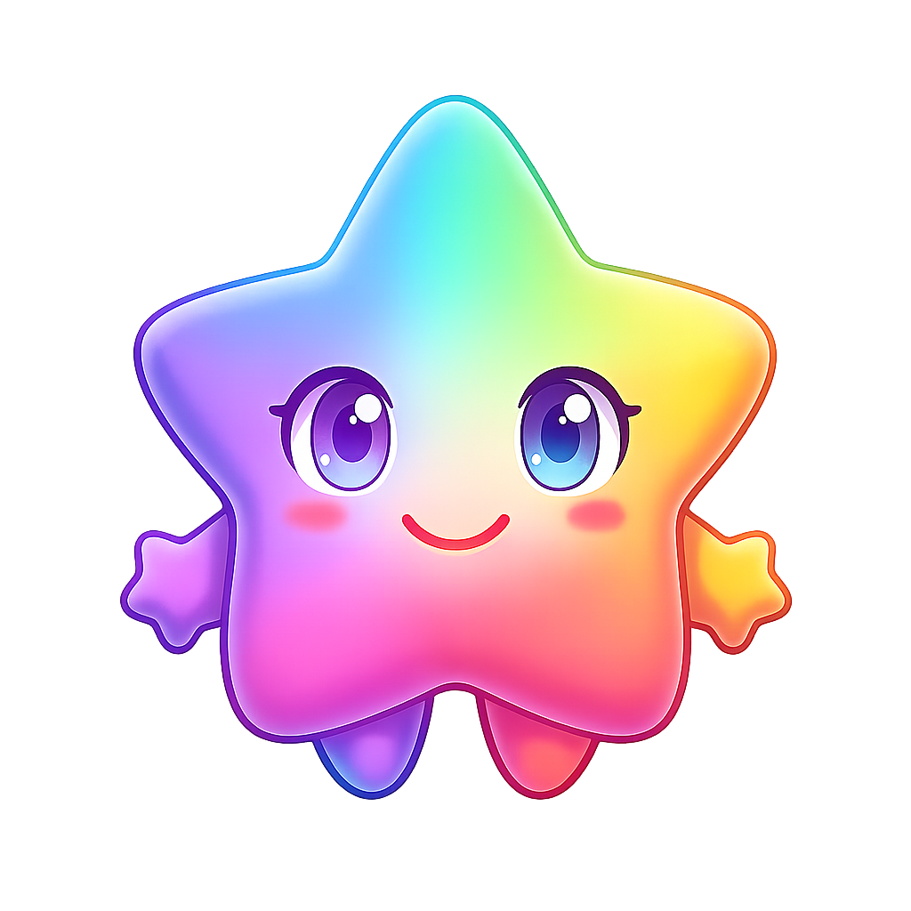

<div align="center"><a name="readme-top"></a>

[][vercel-link]

# mAI

mAI organiza a tus agentes para operar las 24 horas, los 7 días de la semana.

Recluta, planifica y gestiona los informes de todo tu equipo de IA.

Mantienes el control — sin necesidad de estar en línea.

[Français](./README.md) · [English](./README.en-US.md) · **Español** · [Deutsch](./README.de-DE.md) · [Sitio Oficial][official-site] · [Registro de cambios][changelog] · [Documentos][docs] · [Blog][blog] · [Comentarios][github-issues-link]

<!-- SHIELD GROUP -->

[![][github-release-shield]][github-release-link]
[![][docker-release-shield]][docker-release-link]
[![][vercel-shield]][vercel-link]
[![][discord-shield]][discord-link]<br/>
[![][codecov-shield]][codecov-link]
[![][github-action-test-shield]][github-action-test-link]
[![][github-action-release-shield]][github-action-release-link]
[![][github-releasedate-shield]][github-releasedate-link]<br/>
[![][github-contributors-shield]][github-contributors-link]
[![][github-forks-shield]][github-forks-link]
[![][github-stars-shield]][github-stars-link]
[![][github-issues-shield]][github-issues-link]
[![][github-license-shield]][github-license-link]<br>

**Compartir el repositorio de mAI**

[![][share-x-shield]][share-x-link]
[![][share-telegram-shield]][share-telegram-link]
[![][share-whatsapp-shield]][share-whatsapp-link]
[![][share-reddit-shield]][share-reddit-link]
[![][share-weibo-shield]][share-weibo-link]
[![][share-mastodon-shield]][share-mastodon-link]
[![][share-linkedin-shield]][share-linkedin-link]


</sup>

</div>

<details>
<summary><kbd>Tabla de contenidos</kbd></summary>

#### TOC

- [👋🏻 Primeros pasos y unirse a nuestra comunidad](#-primeros-pasos-y-unirse-a-nuestra-comunidad)
- [✨ Características](#-características)
  - [Operador: Los agentes como unidad de trabajo](#operador-los-agentes-como-unidad-de-trabajo)
  - [Crear: Agentes a medida](#crear-agentes-a-medida)
  - [Colaborar: Nuevas formas de redes de colaboración](#colaborar-nuevas-formas-de-redes-de-colaboración)
  - [Evolucionar: Coevolución humanos/agentes](#evolucionar-coevolución-humanosagentes)
- [🛳 Autohospedaje](#-autohospedaje)
  - [`A` Desplegar con Vercel, Zeabur, Sealos o Alibaba Cloud](#a-desplegar-con-vercel-zeabur-sealos-o-alibaba-cloud)
  - [`B` Desplegar con Docker](#b-desplegar-con-docker)
  - [Variables de entorno](#variables-de-entorno)
- [📦 Ecosistema](#-ecosistema)
- [🧩 Plugins](#-plugins)
- [⌨️ Desarrollo local](#️-desarrollo-local)
- [🤝 Contribución](#-contribución)
- [❤️ Patrocinio](#️-patrocinio)
- [🔗 Más productos](#-más-productos)

####

<br/>

</details>

<br/>

## 👋🏻 Primeros pasos y unirse a nuestra comunidad

Somos un grupo de ingenieros y diseñadores apasionados, con la esperanza de proporcionar componentes y herramientas con diseño moderno para la IA generativa.
Al adoptar un enfoque abierto, nuestro objetivo es ofrecer a los desarrolladores y usuarios un ecosistema de producto transparente y amigable.

Ya sea para usuarios o desarrolladores profesionales, mAI será tu patio de recreo para agentes de IA. Ten en cuenta que mAI se encuentra actualmente en desarrollo activo, y tus comentarios son bienvenidos para cualquier [problema][issues-link] que encuentres.

| [](https://www.producthunt.com/products/mAI?launch=mAI-2&embed=true&utm_source=badge-featured&utm_medium=badge&utm_campaign=badge-mAI) | ¡Estamos en vivo en Product Hunt! Nos complace traer mAI al mundo. Si crees en un futuro donde los humanos y los agentes evolucionan juntos, apoya nuestro viaje. |
| :----------------------------------------------------------------------------------------------------------------------------------------------------------------------------------------------------------------------------------------------------------------- | :-------------------------------------------------------------------------------------------------------------------------------------------------------------------- |
| [![][discord-shield-badge]][discord-link]                                                                                                                                                                                                                          | ¡Únete a nuestra comunidad de Discord! Aquí es donde puedes conectarte con desarrolladores y otros usuarios entusiastas de mAI.                                                    |

> [!IMPORTANT]
>
> **Danos una estrella**, recibirás todas las notificaciones de versiones de GitHub sin demora \~ ⭐️

[![][image-star]][github-stars-link]

<details>
  <summary><kbd>Historial de estrellas (Star History)</kbd></summary>
  <picture>
    <source media="(prefers-color-scheme: dark)" srcset="https://api.star-history.com/svg?repos=mAI%2FmAI&theme=dark&type=Date">
    
  </picture>
</details>

## ✨ Características

Los agentes actuales son herramientas aisladas orientadas a tareas específicas. Carecen de contexto, viven aislados y requieren transferencias manuales entre diferentes ventanas y modelos. Aunque algunos mantienen memoria, a menudo es global, superficial e impersonal. De esta manera, los usuarios se ven obligados a alternar entre conversaciones fragmentadas, lo que dificulta la creación de una productividad estructurada.

**mAI lo cambia todo.**

mAI es un espacio de trabajo y estilo de vida para buscar, construir y colaborar con compañeros agentes que crecen contigo. En mAI, tratamos a los **agentes como la unidad de trabajo**, proporcionando una infraestructura donde los humanos y los agentes evolucionan juntos.

### Operador: Los agentes como unidad de trabajo

Recluta, planifica y gestiona informes de todo tu equipo de IA.

- **Más productividad. Menos herramientas**: Reúne a todos tus agentes bajo un mismo techo.
- **Pasarela de mensajería instantánea (IM Gateway)**: Agentes allí donde ya chateas.

[![][back-to-top]](#readme-top)

<div align="right">

[![][back-to-top]](#readme-top)

</div>

### Crear: Agentes a medida

La creación de un equipo de IA personalizado comienza con el **Creador de Agentes** (Agent Builder). Puedes describir lo que necesitas una sola vez y la configuración del agente comenzará de inmediato, aplicando configuraciones automáticas para que puedas usarlo al instante.

- **Inteligencia unificada**: Accede sin problemas a cualquier modelo y modalidad, todo bajo tu control.
- **Más de 10 000 habilidades**: Conecta tus agentes con las habilidades que utilizas a diario gracias a una biblioteca de más de 10 000 herramientas y plugins compatibles con MCP.

[![][back-to-top]](#readme-top)

<div align="right">

[![][back-to-top]](#readme-top)

</div>

### Colaborar: Escalar nuevas formas de redes de colaboración

mAI presenta los **Grupos de Agentes**, lo que te permite trabajar con agentes como si fueran compañeros de equipo reales. El sistema reúne a los agentes adecuados para la tarea, permitiendo la colaboración en paralelo y la mejora iterativa.

- **Páginas**: Escribe y perfecciona contenido con múltiples agentes en un solo lugar con un contexto compartido.
- **Programación**: Programa ejecuciones y deja que los agentes hagan el trabajo en el momento adecuado, incluso cuando no estés.
- **Proyectos**: Organiza el trabajo por proyectos para mantener todo estructurado y fácil de seguir.
- **Espacio de trabajo**: Un espacio compartido para que los equipos colaboren con agentes, garantizando una propiedad clara y visibilidad en toda la organización.

[![][back-to-top]](#readme-top)

<div align="right">

[![][back-to-top]](#readme-top)

</div>

### Evolucionar: Coevolución de humanos y agentes

La mejor IA es aquella que te entiende en profundidad. mAI cuenta con **Memoria Personal** que construye una comprensión clara de tus necesidades.

- **Aprendizaje continuo**: Tus agentes aprenden de cómo trabajas, adaptando su comportamiento para actuar en el momento adecuado.
- **Memoria de caja blanca**: Creemos en la transparencia. Tus agentes utilizan una memoria estructurada y editable, lo que te otorga un control total sobre lo que recuerdan.

<div align="right">

[![][back-to-top]](#readme-top)

</div>

> ✨ Se añadirán más características a medida que mAI evolucione.

<div align="right">

[![][back-to-top]](#readme-top)

</div>

## 🛳 Autohospedaje

mAI ofrece una versión autohospedada con Vercel, Alibaba Cloud y una [imagen de Docker][docker-release-link]. Esto te permite desplegar tu propio chatbot en pocos minutos y sin necesidad de conocimientos previos.

> [!TIP]
>
> Consulta más información sobre cómo [📘 Construir tu propio mAI][docs-self-hosting].

### `A` Despliegue con Vercel, Zeabur, Sealos o Alibaba Cloud

Si deseas desplegar este servicio tú mismo en Vercel, Zeabur o Alibaba Cloud, puedes seguir estos pasos:

- Prepara tu [clave API de OpenAI](https://platform.openai.com/account/api-keys).
- Haz clic en el botón de abajo para iniciar el despliegue: inicia sesión directamente con tu cuenta de GitHub y recuerda completar la variable de entorno `OPENAI_API_KEY` (obligatoria) en la sección de variables de entorno.
- Después del despliegue, podrás empezar a usarlo.
- Asocia un dominio personalizado (opcional): los DNS del dominio asignado por Vercel están bloqueados en algunas regiones; asociar un dominio personalizado permite conectarse directamente.

<div align="center">

| Desplegar con Vercel | Desplegar con Zeabur | Desplegar con Sealos | Desplegar con RepoCloud | Desplegar con Alibaba Cloud |
| :-----------------: | :------------------: | :------------------: | :---------------------: | :-------------------------: |
| [![][deploy-button-image]][deploy-link] | [![][deploy-on-zeabur-button-image]][deploy-on-zeabur-link] | [![][deploy-on-sealos-button-image]][deploy-on-sealos-link] | [![][deploy-on-repocloud-button-image]][deploy-on-repocloud-link] | [![][deploy-on-alibaba-cloud-button-image]][deploy-on-alibaba-cloud-link] |

</div>

#### Después de hacer un Fork

Después de hacer el fork, conserva únicamente la acción de sincronización con el repositorio ascendente (upstream sync) y desactiva las demás acciones en tu repositorio de GitHub.

#### Mantenerse actualizado

Si has desplegado tu propio proyecto siguiendo los pasos de despliegue con un solo clic en el README, es posible que encuentres avisos constantes que indican "actualizaciones disponibles". Esto se debe a que Vercel crea por defecto un nuevo proyecto en lugar de hacer un fork de este, lo que impide detectar las actualizaciones con precisión.

> [!TIP]
>
> Te sugerimos volver a realizar el despliegue siguiendo estos pasos, [📘 Sincronización automática con la última versión][docs-upstream-sync]

<br/>

### `B` Despliegue con Docker

[![][docker-release-shield]][docker-release-link]
[![][docker-size-shield]][docker-size-link]
[![][docker-pulls-shield]][docker-pulls-link]

Proporcionamos una imagen de Docker para desplegar el servicio mAI en tu propio dispositivo privado. Utiliza el siguiente comando para iniciar el servicio mAI:

1. Crea una carpeta para almacenar los archivos

```fish
$ mkdir mAI-db && cd mAI-db
```

2. Inicializa la infraestructura de mAI

```fish
bash <(curl -fsSL https://lobe.li/setup.sh)
```

3. Inicia el servicio de mAI

```fish
docker compose up -d
```

> [!NOTE]
>
> Para obtener instrucciones detalladas sobre el despliegue con Docker, consulta la [📘 Guía de despliegue con Docker][docs-docker]

<br/>

### Variables de entorno

Este proyecto proporciona algunos elementos de configuración adicionales que se establecen mediante variables de entorno:

| Variable de entorno | Obligatorio | Descripción | Ejemplo |
| -------------------- | -------- | ------------------------------------------------------------------------------------------------------------------------------------------------------------------------- | -------------------------------------------------------------------------------------------------------------------- |
| `OPENAI_API_KEY` | Sí | Esta es la clave API que solicitas en la página de cuenta de OpenAI | `sk-xxxxxx...xxxxxx` |
| `OPENAI_PROXY_URL` | No | Si configuras manualmente un proxy para la interfaz de OpenAI, puedes usar esta opción para invalidar la URL base de solicitud predeterminada de la API de OpenAI | `https://api.chatanywhere.cn` o `https://aihubmix.com/v1` <br/>El valor predeterminado es<br/>`https://api.openai.com/v1` |
| `OPENAI_MODEL_LIST` | No | Se utiliza para controlar la lista de modelos. Utiliza `+` para añadir un modelo, `-` para ocultar un modelo y `nombre_modelo=nombre_a_mostrar` para personalizar el nombre de visualización de un modelo, separados por comas. | `qwen-7b-chat,+glm-6b,-gpt-3.5-turbo` |

> [!NOTE]
>
> La lista completa de variables de entorno se puede encontrar en la [📘 Guía de variables de entorno][docs-env-var]

<div align="right">

[![][back-to-top]](#readme-top)

</div>

## 📦 Ecosistema

| NPM | Repositorio | Descripción | Versión |
| --------------------------------- | --------------------------------------- | ----------------------------------------------------------------------------------------------------- | ----------------------------------------- |
| [@lobehub/ui][lobe-ui-link] | [lobehub/lobe-ui][lobe-ui-github] | Biblioteca de componentes de interfaz de usuario de código abierto dedicada a la creación de aplicaciones web AIGC. | [![][lobe-ui-shield]][lobe-ui-link] |
| [@lobehub/icons][lobe-icons-link] | [lobehub/lobe-icons][lobe-icons-github] | Colección de iconos y logotipos SVG de marcas de modelos de IA / LLM populares. | [![][lobe-icons-shield]][lobe-icons-link] |
| [@lobehub/tts][lobe-tts-link] | [lobehub/lobe-tts][lobe-tts-github] | Biblioteca de React Hooks de TTS/STT fiable y de alta calidad. | [![][lobe-tts-shield]][lobe-tts-link] |
| [@lobehub/lint][lobe-lint-link] | [lobehub/lobe-lint][lobe-lint-github] | Configuraciones de ESlint, Stylelint, Commitlint, Prettier, Remark y Semantic Release para mAI. | [![][lobe-lint-shield]][lobe-lint-link] |

<div align="right">

[![][back-to-top]](#readme-top)

</div>

## 🧩 Plugins

Los plugins proporcionan un medio para extender las capacidades de [Llamada a funciones (Function Calling)][docs-function-call] de mAI. Pueden utilizarse para introducir nuevas llamadas a funciones e incluso nuevas formas de representar los resultados de los mensajes. Si estás interesado en el desarrollo de plugins, consulta nuestra [📘 Guía de desarrollo de plugins][docs-plugin-dev] en la Wiki.

- [lobe-chat-plugins][lobe-chat-plugins]: Este es el índice de plugins para mAI. Accede al archivo index.json de este repositorio para mostrar al usuario una lista de plugins disponibles para mAI.
- [chat-plugin-template][chat-plugin-template]: Esta es la plantilla de plugin para el desarrollo de plugins de mAI.
- [@lobehub/chat-plugin-sdk][chat-plugin-sdk]: El SDK de plugins de mAI te ayuda a crear plugins de chat excepcionales para mAI.
- [@lobehub/chat-plugins-gateway][chat-plugins-gateway]: La pasarela de plugins de mAI (mAI Plugins Gateway) es un servicio de backend que proporciona una pasarela para los plugins de mAI. Desplegamos este servicio utilizando Vercel. La API principal POST /api/v1/runner se despliega como una Edge Function.

> [!NOTE]
>
> El sistema de plugins se encuentra actualmente en una fase de desarrollo importante. Puedes obtener más información en los siguientes hilos de discusión (issues):
>
> - [x] [**Fase de Plugin 1**](https://github.com/mDevsLabs/mAI/issues/73): Implementar la separación del plugin del cuerpo principal, dividir el plugin en un repositorio independiente para su mantenimiento y realizar la carga dinámica del plugin.
> - [x] [**Fase de Plugin 2**](https://github.com/mDevsLabs/mAI/issues/97): Seguridad y estabilidad en el uso de los plugins, presentación más precisa de estados anómalos, mantenibilidad de la arquitectura de plugins y facilidad de uso para los desarrolladores.
> - [x] [**Fase de Plugin 3**](https://github.com/mDevsLabs/mAI/issues/149): Capacidades de personalización de mayor nivel y más completas, soporte para autenticación de plugins y ejemplos.

<div align="right">

[![][back-to-top]](#readme-top)

</div>

## ⌨️ Desarrollo local

Puedes usar GitHub Codespaces para el desarrollo en línea:

[![][codespaces-shield]][codespaces-link]

O clonarlo para el desarrollo local:

```fish
$ git clone https://github.com/mDevsLabs/mAI.git
$ cd mAI
$ pnpm install
$ pnpm dev          # Full-stack (Next.js + Vite SPA)
$ bun run dev:spa   # Solo frontend SPA (puerto 9876)
```

> **Proxy de depuración**: Después de ejecutar `dev:spa`, la terminal mostrará una URL de proxy como
> `https://app.mAI.com/_dangerous_local_dev_proxy?debug-host=http%3A%2F%2Flocalhost%3A9876`.
> Ábrela para desarrollar localmente con soporte HMR (reemplazo en caliente de módulos) contra el backend de producción.

Si deseas obtener más detalles, no dudes en consultar nuestra [📘 Guía de desarrollo][docs-dev-guide].

<div align="right">

[![][back-to-top]](#readme-top)

</div>

## 🤝 Contribución

Las contribuciones de todo tipo son más que bienvenidas; si estás interesado en contribuir con código, no dudes en consultar nuestras [Incidencias (Issues)][github-issues-link] y [Proyectos (Projects)][github-project-link] de GitHub para participar activamente y demostrarnos de lo que eres capaz.

> [!TIP]
>
> Estamos creando un foro impulsado por la tecnología que fomenta la interacción de conocimientos y el intercambio de ideas, lo cual puede culminar en inspiración mutua e innovación colaborativa.
>
> Ayúdanos a mejorar mAI. Te invitamos a enviarnos directamente tus comentarios sobre el diseño del producto y discusiones sobre la experiencia del usuario.
>
> **Mantenedores principales:** [@arvinxx](https://github.com/arvinxx) [@canisminor1990](https://github.com/canisminor1990)

[![][pr-welcome-shield]][pr-welcome-link]
[![][submit-agents-shield]][submit-agents-link]
[![][submit-plugin-shield]][submit-plugin-link]

<a href="https://github.com/mDevsLabs/mAI/graphs/contributors" target="_blank">
  <table>
    <tr>
      <th colspan="2">
        <br><br><br>
      </th>
    </tr>
    <tr>
      <td>
        <picture>
          <source media="(prefers-color-scheme: dark)" srcset="https://next.ossinsight.io/widgets/official/compose-org-active-contributors/thumbnail.png?activity=active&period=past_28_days&owner_id=131470832&repo_ids=643445235&image_size=2x3&color_scheme=dark">
          
        </picture>
      </td>
      <td rowspan="2">
        <picture>
          <source media="(prefers-color-scheme: dark)" srcset="https://next.ossinsight.io/widgets/official/compose-org-participants-growth/thumbnail.png?activity=active&period=past_28_days&owner_id=131470832&repo_ids=643445235&image_size=4x7&color_scheme=dark">
          
        </picture>
      </td>
    </tr>
    <tr>
      <td>
        <picture>
          <source media="(prefers-color-scheme: dark)" srcset="https://next.ossinsight.io/widgets/official/compose-org-active-contributors/thumbnail.png?activity=new&period=past_28_days&owner_id=131470832&repo_ids=643445235&image_size=2x3&color_scheme=dark">
          
        </picture>
      </td>
    </tr>
  </table>
</a>

<div align="right">

[![][back-to-top]](#readme-top)

</div>

## ❤️ Patrocinio

¡Cada pequeña contribución cuenta y tu donación única brilla en nuestra galaxia de apoyo! Eres una estrella fugaz que tiene un impacto rápido y brillante en nuestro viaje. Gracias por creer en nosotros: tu generosidad nos guía hacia nuestra misión, un destello brillante a la vez.

<a href="https://opencollective.com/mAI" target="_blank">
  <picture>
    <source media="(prefers-color-scheme: dark)" srcset="https://github.com/mAI/.github/blob/main/static/sponsor-dark.png?raw=true">
    
  </picture>
</a>

<div align="right">

[![][back-to-top]](#readme-top)

</div>

## 🔗 Más productos

- **[🅰️ Lobe SD Theme][lobe-theme]:** Tema moderno para Stable Diffusion WebUI, diseño de interfaz exquisito, interfaz de usuario altamente personalizable y funciones para aumentar la eficiencia.
- **[⛵️ Lobe Midjourney WebUI][lobe-midjourney-webui]:** Interfaz web para Midjourney que aprovecha la IA para generar rápidamente una amplia gama de imágenes ricas y diversas a partir de indicaciones de texto, fomentando la creatividad y mejorando las conversaciones.
- **[🌏 Lobe i18n][lobe-i18n] :** Lobe i18n es una herramienta de automatización para el proceso de traducción i18n (internacionalización) impulsada por ChatGPT. Admite funciones como división automática de archivos grandes, actualizaciones incrementales y opciones de personalización para el modelo de OpenAI, proxy de API y temperatura.
- **[💌 Lobe Commit][lobe-commit]:** Lobe Commit es una herramienta de interfaz de línea de comandos (CLI) que aprovecha Langchain/ChatGPT para generar mensajes de confirmación basados en Gitmoji.

<div align="right">

[![][back-to-top]](#readme-top)

</div>

---

<details><summary><h4>📝 Licencia</h4></summary>

[![][fossa-license-shield]][fossa-license-link]

</details>

Copyright © 2026 [mAI][profile-link]. <br />
Este proyecto está bajo la licencia [mAI Community License](./LICENSE).

<!-- LINK GROUP -->

[back-to-top]: https://img.shields.io/badge/-BACK_TO_TOP-151515?style=flat-square
[blog]: https://mAI.com/blog
[changelog]: https://mAI.com/changelog
[chat-plugin-sdk]: https://github.com/mAI/chat-plugin-sdk
[chat-plugin-template]: https://github.com/mAI/chat-plugin-template
[chat-plugins-gateway]: https://github.com/mAI/chat-plugins-gateway
[codecov-link]: https://codecov.io/gh/mAI/mAI
[codecov-shield]: https://img.shields.io/codecov/c/github/mAI/mAI?labelColor=black&style=flat-square&logo=codecov&logoColor=white
[codespaces-link]: https://codespaces.new/mAI/mAI
[codespaces-shield]: https://github.com/codespaces/badge.svg
[deploy-button-image]: https://vercel.com/button
[deploy-link]: https://vercel.com/new/clone?repository-url=https%3A%2F%2Fgithub.com%2FmAI%2FmAI&env=OPENAI_API_KEY&envDescription=Find%20your%20OpenAI%20API%20Key%20by%20click%20the%20right%20Learn%20More%20button.&envLink=https%3A%2F%2Fplatform.openai.com%2Faccount%2Fapi-keys&project-name=mAI&repository-name=mAI
[deploy-on-alibaba-cloud-button-image]: https://service-info-public.oss-cn-hangzhou.aliyuncs.com/computenest-en.svg
[deploy-on-alibaba-cloud-link]: https://computenest.console.aliyun.com/service/instance/create/default?type=user&ServiceName=mAI%E7%A4%BE%E5%8C%BA%E7%89%88
[deploy-on-repocloud-button-image]: https://d16t0pc4846x52.cloudfront.net/deploylobe.svg
[deploy-on-repocloud-link]: https://repocloud.io/details/?app_id=248
[deploy-on-sealos-button-image]: https://raw.githubusercontent.com/labring-actions/templates/main/Deploy-on-Sealos.svg
[deploy-on-sealos-link]: https://template.usw.sealos.io/deploy?templateName=mAI-db
[deploy-on-zeabur-button-image]: https://zeabur.com/button.svg
[deploy-on-zeabur-link]: https://zeabur.com/templates/VZGGTI
[discord-link]: https://discord.gg/fV7zwdGPpY
[discord-shield]: https://img.shields.io/discord/1127171173982154893?color=5865F2&label=discord&labelColor=black&logo=discord&logoColor=white&style=flat-square
[discord-shield-badge]: https://img.shields.io/discord/1127171173982154893?color=5865F2&label=discord&labelColor=black&logo=discord&logoColor=white&style=for-the-badge
[docker-pulls-link]: https://hub.docker.com/r/lobehub/lobe-chat
[docker-pulls-shield]: https://img.shields.io/docker/pulls/lobehub/lobe-chat?color=45cc11&labelColor=black&style=flat-square&sort=semver
[docker-release-link]: https://hub.docker.com/r/lobehub/lobe-chat
[docker-release-shield]: https://img.shields.io/docker/v/lobehub/lobe-chat?color=369eff&label=docker&labelColor=black&logo=docker&logoColor=white&style=flat-square&sort=semver
[docker-size-link]: https://hub.docker.com/r/lobehub/lobe-chat
[docker-size-shield]: https://img.shields.io/docker/image-size/lobehub/lobe-chat?color=369eff&labelColor=black&style=flat-square&sort=semver
[docs]: https://mAI.com/docs/usage/start
[docs-dev-guide]: https://mAI.com/docs/development/start
[docs-docker]: https://mAI.com/docs/self-hosting/server-database/docker-compose
[docs-env-var]: https://mAI.com/docs/self-hosting/environment-variables
[docs-function-call]: https://mAI.com/blog/openai-function-call
[docs-plugin-dev]: https://mAI.com/docs/usage/plugins/development
[docs-self-hosting]: https://mAI.com/docs/self-hosting/start
[docs-upstream-sync]: https://mAI.com/docs/self-hosting/advanced/upstream-sync
[fossa-license-link]: https://app.fossa.com/projects/git%2Bgithub.com%2FmAI%2FmAI
[fossa-license-shield]: https://app.fossa.com/api/projects/git%2Bgithub.com%mDevsLabs%2FmAI.svg?type=large
[github-action-release-link]: https://github.com/actions/workflows/mDevsLabs/mAI/release.yml
[github-action-release-shield]: https://img.shields.io/github/actions/workflow/status/mDevsLabs/mAI/release.yml?label=release&labelColor=black&logo=githubactions&logoColor=white&style=flat-square
[github-action-test-link]: https://github.com/actions/workflows/mDevsLabs/mAI/test.yml
[github-action-test-shield]: https://img.shields.io/github/actions/workflow/status/mDevsLabs/mAI/test.yml?label=test&labelColor=black&logo=githubactions&logoColor=white&style=flat-square
[github-contributors-link]: https://github.com/mDevsLabs/mAI/graphs/contributors
[github-contributors-shield]: https://img.shields.io/github/contributors/mDevsLabs/mAI?color=c4f042&labelColor=black&style=flat-square
[github-forks-link]: https://github.com/mDevsLabs/mAI/network/members
[github-forks-shield]: https://img.shields.io/github/forks/mDevsLabs/mAI?color=8ae8ff&labelColor=black&style=flat-square
[github-issues-link]: https://github.com/mDevsLabs/mAI/issues
[github-issues-shield]: https://img.shields.io/github/issues/mDevsLabs/mAI?color=ff80eb&labelColor=black&style=flat-square
[github-license-link]: https://github.com/mDevsLbas/mAI/blob/canary/LICENSE
[github-license-shield]: https://img.shields.io/badge/license-apache%202.0-white?labelColor=black&style=flat-square
[github-project-link]: https://github.com/mDevsLabs/mAI/projects
[github-release-link]: https://github.com/mDevsLabs/mAI/releases
[github-release-shield]: https://img.shields.io/github/v/release/mDevsLabs/mAI?color=369eff&labelColor=black&logo=github&style=flat-square
[github-releasedate-link]: https://github.com/mDevsLabs/mAI/releases
[github-releasedate-shield]: https://img.shields.io/github/release-date/mDevsLabs/mAI?labelColor=black&style=flat-square
[github-stars-link]: https://github.com/mDevsLabs/mAI/stargazers
[github-stars-shield]: https://img.shields.io/github/stars/mDevsLabs/mAI?color=ffcb47&labelColor=black&style=flat-square
[image-banner]: ./public/avatars/may.PNG
[image-star]: https://github.com/user-attachments/assets/3216e25b-186f-4a54-9cb4-2f124aec0471
[issues-link]: https://img.shields.io/github/issues/lobehub/mAI.svg?style=flat
[lobe-chat-plugins]: https://github.com/lobehub/lobe-chat-plugins
[lobe-commit]: https://github.com/lobehub/lobe-commit/tree/master/packages/lobe-commit
[lobe-i18n]: https://github.com/lobehub/lobe-commit/tree/master/packages/lobe-i18n
[lobe-icons-github]: https://github.com/lobehub/lobe-icons
[lobe-icons-link]: https://www.npmjs.com/package/@lobehub/icons
[lobe-icons-shield]: https://img.shields.io/npm/v/@lobehub/icons?color=369eff&labelColor=black&logo=npm&logoColor=white&style=flat-square
[lobe-lint-github]: https://github.com/lobehub/lobe-lint
[lobe-lint-link]: https://www.npmjs.com/package/@lobehub/lint
[lobe-lint-shield]: https://img.shields.io/npm/v/@lobehub/lint?color=369eff&labelColor=black&logo=npm&logoColor=white&style=flat-square
[lobe-midjourney-webui]: https://github.com/lobehub/lobe-midjourney-webui
[lobe-theme]: https://github.com/lobehub/sd-webui-lobe-theme
[lobe-tts-github]: https://github.com/lobehub/lobe-tts
[lobe-tts-link]: https://www.npmjs.com/package/@lobehub/tts
[lobe-tts-shield]: https://img.shields.io/npm/v/@lobehub/tts?color=369eff&labelColor=black&logo=npm&logoColor=white&style=flat-square
[lobe-ui-github]: https://github.com/lobehub/lobe-ui
[lobe-ui-link]: https://www.npmjs.com/package/@lobehub/ui
[lobe-ui-shield]: https://img.shields.io/npm/v/@lobehub/ui?color=369eff&labelColor=black&logo=npm&logoColor=white&style=flat-square
[official-site]: https://mAI.com
[pr-welcome-link]: https://github.com/mDevsLabs/mAI/pulls
[pr-welcome-shield]: https://img.shields.io/badge/🤯_pr_welcome-%E2%86%92-ffcb47?labelColor=black&style=for-the-badge
[profile-link]: https://github.com/mAI
[share-linkedin-link]: https://linkedin.com/feed
[share-linkedin-shield]: https://img.shields.io/badge/-share%20on%20linkedin-black?labelColor=black&logo=linkedin&logoColor=white&style=flat-square
[share-mastodon-link]: https://mastodon.social/share?text=Check%20this%20GitHub%20repository%20out%20%F0%9F%A4%AF%20mAI%20-%20An%20open-source,%20extensible%20%28Function%20Calling%29,%20high-performance%20chatbot%20framework.%20It%20supports%20one-click%20free%20deployment%20of%20your%20private%20ChatGPT%2FLLM%20web%20application.%20https://github.com/mDevsLabs/mAI%20#chatbot%20#chatGPT%20#openAI
[share-mastodon-shield]: https://img.shields.io/badge/-share%20on%20mastodon-black?labelColor=black&logo=mastodon&logoColor=white&style=flat-square
[share-reddit-link]: https://www.reddit.com/submit?title=Check%20this%20GitHub%20repository%20out%20%F0%9F%A4%AF%20mAI%20-%20An%20open-source%2C%20extensible%20%28Function%20Calling%29%2C%20high-performance%20chatbot%20framework.%20It%20supports%20one-click%20free%20deployment%20of%20your%20private%20ChatGPT%2FLLM%20web%20application.%20%23chatbot%20%23chatGPT%20%23openAI&url=https%3A%2F%2Fgithub.com%2FmAI%2FmAI
[share-reddit-shield]: https://img.shields.io/badge/-share%20on%20reddit-black?labelColor=black&logo=reddit&logoColor=white&style=flat-square
[share-telegram-link]: https://t.me/share/url"?text=Check%20this%20GitHub%20repository%20out%20%F0%9F%A4%AF%20mAI%20-%20An%20open-source%2C%20extensible%20%28Function%20Calling%29%2C%20high-performance%20chatbot%20framework.%20It%20supports%20one-click%20free%20deployment%20of%20your%20private%20ChatGPT%2FLLM%20web%20application.%20%23chatbot%20%23chatGPT%20%23openAI&url=https%3A%2F%2Fgithub.com%2FmAI%2FmAI
[share-telegram-shield]: https://img.shields.io/badge/-share%20on%20telegram-black?labelColor=black&logo=telegram&logoColor=white&style=flat-square
[share-weibo-link]: http://service.weibo.com/share/share.php?sharesource=weibo&title=Check%20this%20GitHub%20repository%20out%20%F0%9F%A4%AF%20mAI%20-%20An%20open-source%2C%20extensible%20%28Function%20Calling%29%2C%20high-performance%20chatbot%20framework.%20It%20supports%20one-click%20free%20deployment%20of%20your%20private%20ChatGPT%2FLLM%20web%20application.%20%23chatbot%20%23chatGPT%20%23openAI&url=https%3A%2F%2Fgithub.com%2FmAI%2FmAI
[share-weibo-shield]: https://img.shields.io/badge/-share%20on%20weibo-black?labelColor=black&logo=sinaweibo&logoColor=white&style=flat-square
[share-whatsapp-link]: https://api.whatsapp.com/send?text=Check%20this%20GitHub%20repository%20out%20%F0%9F%A4%AF%20mAI%20-%20An%20open-source%2C%20extensible%20%28Function%20Calling%29%2C%20high-performance%20chatbot%20framework.%20It%20supports%20one-click%20free%20deployment%20of%20your%20private%20ChatGPT%2FLLM%20web%20application.%20https%3A%2F%2Fgithub.com%2FmAI%2FmAI%20%23chatbot%20%23chatGPT%20%23openAI
[share-whatsapp-shield]: https://img.shields.io/badge/-share%20on%20whatsapp-black?labelColor=black&logo=whatsapp&logoColor=white&style=flat-square
[share-x-link]: https://x.com/intent/tweet?hashtags=chatbot%2CchatGPT%2CopenAI&text=Check%20this%20GitHub%20repository%20out%20%F0%9F%A4%AF%20mAI%20-%20An%20open-source%2C%20extensible%20%28Function%20Calling%29%2C%20high-performance%20chatbot%20framework.%20It%20supports%20one-click%20free%20deployment%20of%20your%20private%20ChatGPT%2FLLM%20web%20application.&url=https%3A%2F%2Fgithub.com%2FmAI%2FmAI
[share-x-shield]: https://img.shields.io/badge/-share%20on%20x-black?labelColor=black&logo=x&logoColor=white&style=flat-square
[submit-agents-link]: https://github.com/mDevsLabs/mAI-agents
[submit-agents-shield]: https://img.shields.io/badge/🤖/🏪_submit_agent-%E2%86%92-c4f042?labelColor=black&style=for-the-badge
[submit-plugin-link]: https://github.com/mDevsLabs/mAI-plugins
[submit-plugin-shield]: https://img.shields.io/badge/🧩/🏪_submit_plugin-%E2%86%92-95f3d9?labelColor=black&style=for-the-badge
[vercel-link]: https://mprojects-officiel.vercel.app
[vercel-shield]: https://img.shields.io/badge/vercel-online-55b467?labelColor=black&logo=vercel&style=flat-square
